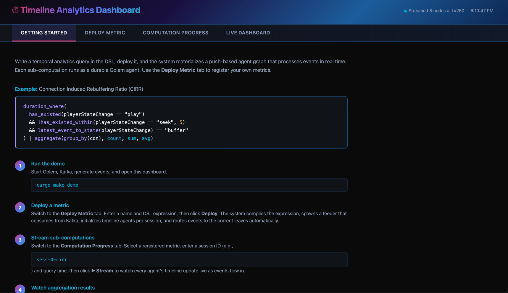
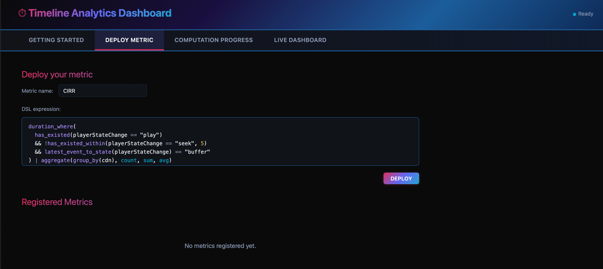
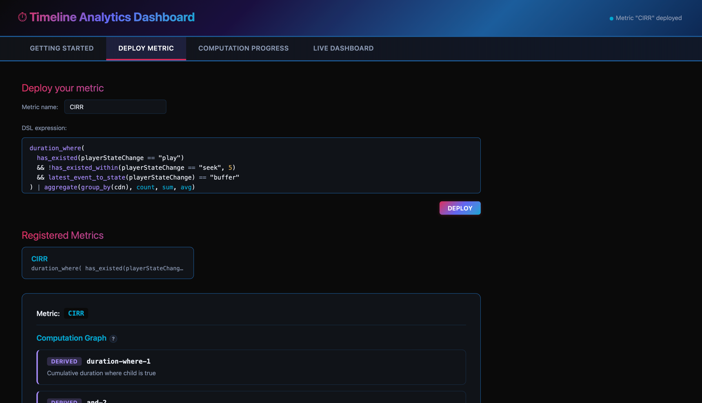
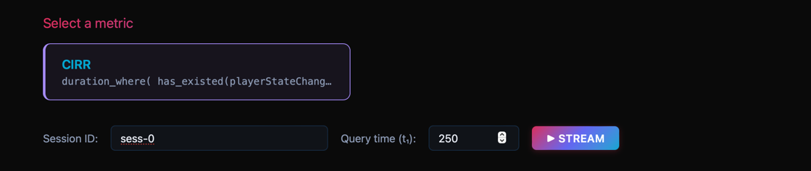
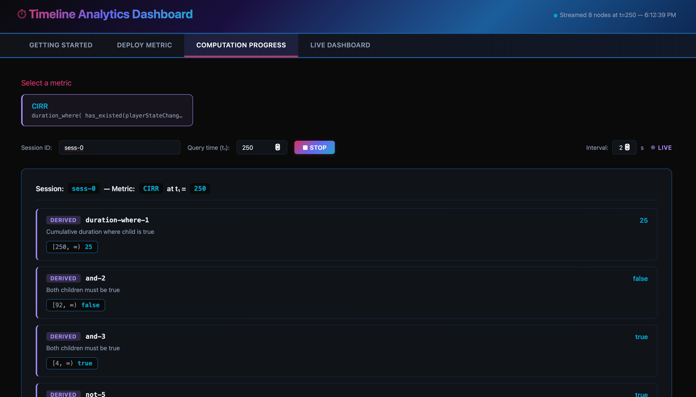
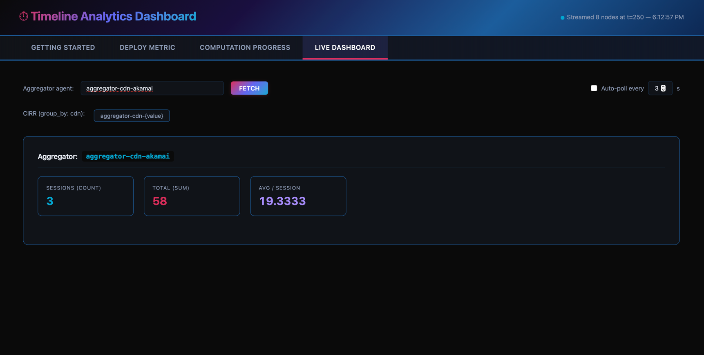

# Durable Timeline Analytics For Data Engineering

This is inspired from [TimeLine Analytics](https://www.cidrdb.org/cidr2023/papers/p22-milner.pdf) and it's extention, but most importantly,
system being backed by new agentic runtime [Golem](https://learn.golem.cloud) that's also a durable execution engine.

Watch the talk from Afsal at [LambdaConf:2024:Estes-Park:Colorado](https://www.youtube.com/watch?v=9WjUBOfgriY) or refer presentation slides [here](https://github.com/afsalthaj/golem-timeline-presentation/blob/main/presentation_last.pdf)


# A management UI



## Deploy a Metric



### After deploy



## Sub computation result streaming







## Aggregation Results




You will get more idea about the dashboard soon.

### A quick demo 

```sh
cargo make demo

# go to the dashboard at http://localhost:3000
```

## Timeline Query DSL

A text-based DSL for expressing temporal analytics over event streams. Write a query, deploy it,
and the system materializes a push-based agent graph that processes events in real time.

### CIRR — Connection Induced Rebuffering Ratio

A user is experiencing connection-induced rebuffering when:
1. They started playing at some point (`has_existed`)
2. There was no recent seek event (`!has_existed_within` — rules out seek-induced buffering)
3. The current player state is `"buffer"` (`latest_event_to_state == "buffer"`)

All three must be true simultaneously, and we measure how long that condition holds.

```javascript
duration_where(
  has_existed(playerStateChange == "play")
  && !has_existed_within(playerStateChange == "seek", 5)
  && latest_event_to_state(playerStateChange) == "buffer"
)
```

With cross-session aggregation per CDN:

```javascript
duration_where(
  has_existed(playerStateChange == "play")
  && !has_existed_within(playerStateChange == "seek", 5)
  && latest_event_to_state(playerStateChange) == "buffer"
) | aggregate(group_by(cdn), count, sum, avg)
```


### More examples

**Time spent idle per region:**
```javascript
duration_in_cur_state(
  latest_event_to_state(status) == "idle"
) | aggregate(group_by(region), count, avg, max)
```

**Credit card location anomaly — location changed too quickly:**
```javascript
duration_in_cur_state(
  latest_event_to_state(location)) 
) < 600
```
If the cardholder has been at the current location for less than 600 seconds,
the location just changed — flag it as a potential anomaly (e.g., New York → London in 10 minutes).

**User engaged: played and never errored:**
```javascript
has_existed(playerStateChange == "play") && !has_existed(error == "fatal")
```

## Quick Start — CIRR Demo

Run the full CIRR pipeline end-to-end with a single command. Requires Docker (for Kafka) and [Golem CLI 1.4.1+](https://learn.golem.cloud).

```bash
cargo make demo
```

This will:
1. Start a local Golem server and Kafka broker
2. Build and deploy the timeline WASM component
3. Initialize 9 CIRR sessions across 3 CDNs (akamai, cloudfront, fastly)
4. Feed realistic playback events (init → play → buffer → play) to each session
5. Open a dashboard at **http://localhost:3000**

### Sub-computation results and their progress for debuggability

The CIRR expression compiles into **8 Golem agents per session**. The **Computation Progress** tab in the dashboard lets you query every sub-computation's result and its progress at any point in time:

```
duration-where-1         ← root: cumulative seconds where CIRR is true
and-2                    ← all 3 conditions combined
and-3                    ← has-existed ∧ ¬has-existed-within
has-existed-4            ← LEAF: has playerStateChange == "play" ever occurred?
not-5                    ← negation of has-existed-within-6
has-existed-within-6     ← LEAF: was there a seek within the last 5 time units?
equal-to-7               ← is the current player state "buffer"?
latest-event-to-state-8  ← LEAF: what is the latest playerStateChange value?
```

Once the demo is running and the dashboard is open at http://localhost:3000:

1. Click the **Computation Progress** tab
2. Click the **`demo-akamai-1`** preset button (session ID is pre-filled)
3. Leave query time at **250** and click **Query All Nodes**

You'll immediately see every sub-computation's result:

- **latest-event-to-state-8** (leaf) shows `"buffer"` — the latest `playerStateChange` value
- **has-existed-4** (leaf) shows `true` — "play" has existed at some point
- **has-existed-within-6** (leaf) shows `false` — no seek event within the last 5 time units
- **not-5** (derived) shows `true` — negation of has-existed-within-6 (¬false = true)
- **equal-to-7** (derived) shows `true` — latest state equals "buffer"
- **and-3** (derived) shows `true` — has_existed ∧ ¬has_existed_within
- **and-2** (derived) shows `true` — all three CIRR conditions are met
- **duration-where-1** (root) shows the cumulative rebuffering duration in seconds

Try changing the query time to **120** (before the buffer event) and clicking again — you'll see how the sub-computations differ.

- **Leaf nodes** (green) hold raw state computed from ingested events
- **Derived nodes** (blue) hold recomputed results from their children

Each result is a local point-in-time lookup (~10ms per agent invoke) — no cascading RPC. The push cascade has already propagated all changes upward.

### Viewing aggregation results

Once you've seen the per-session sub-computations, switch to aggregated metrics:

1. Click the **Live Dashboard** tab
2. Click **`cdn: akamai`** — results appear immediately

The metrics show cross-session totals for all 3 akamai sessions:
- **Count** = 3 (three sessions on this CDN)
- **Sum** — total CIRR rebuffering duration (seconds) across all 3 sessions
- **Avg** — average CIRR per session (sum ÷ 3)

Click **`cdn: cloudfront`** or **`cdn: fastly`** to compare CDNs.

### Cleanup

Press `Ctrl+C` to stop the dashboard. The demo script automatically stops Golem and Kafka.

## Overview

The project is a merging the ideas from the TimeLine DSL — a composable language for expressing temporal analytics over event streams, into Golem's Runtime.
Each node in a timeline expression maps to a durable Golem agent (worker). The architecture is **fully push-based**:
leaf nodes ingest events and push state changes upward through the agent tree. Derived nodes recompute
incrementally on each notification and cascade changes to their parents. Point-in-time queries are local
lookups on precomputed state — no cascading RPC required at query time.

### Architecture

```
                          ┌─────────────────┐
                          │ TimelineDriver   │  (1) Walks the DSL tree, spawns agents,
                          │ (orchestrator)   │      wires ParentRef / AggregatorRef
                          └────────┬────────┘
                                   │ spawns & wires
              ┌────────────────────┼────────────────────┐
              ▼                    ▼                     ▼
   ┌──────────────────┐ ┌──────────────────┐  ┌──────────────────┐
   │ EventProcessor   │ │ EventProcessor   │  │ EventProcessor   │
   │ (leaf: has_exist) │ │ (leaf: latest)   │  │ (leaf: within)   │
   └────────┬─────────┘ └────────┬─────────┘  └────────┬─────────┘
            │ push                │ push                │ push
            ▼                    ▼                     ▼
   ┌──────────────────┐ ┌──────────────────┐
   │TimelineProcessor │ │TimelineProcessor │  (2) Receives on_child_state_changed,
   │ (derived: And)   │ │ (derived: EqualTo│      recomputes, pushes to parent
   └────────┬─────────┘ └────────┬─────────┘
            │ push                │ push
            └────────┬───────────┘
                     ▼
          ┌──────────────────┐       ┌──────────────────┐
          │TimelineProcessor │──────▶│   Aggregator     │  (3) Root pushes deltas
          │ (root: Duration) │ delta │ (cross-session)  │      to aggregator
          └──────────────────┘       └──────────────────┘
```


### Data flow

1. **Event ingestion** — An event arrives at an `EventProcessor` via `add_event`.
2. **Leaf computation** — The leaf evaluates its operation (e.g., "has `status == error` ever been true?")
   and records the result in its local `StateDynamicsTimeLine`.
3. **Parent notification** — If the state changed, the leaf calls `on_child_state_changed` on its parent
   `TimelineProcessor` (identified by the `ParentRef` wired during initialization).
4. **Derived recomputation** — The `TimelineProcessor` updates its own state and, if changed, pushes
   upward to *its* parent. This cascade continues until the root node is reached.
5. **Aggregator update** — If the root node has an `AggregatorRef`, it computes the delta between the
   old and new numeric value and calls `on_delta` on the `Aggregator` agent. The aggregator maintains
   only running accumulators (sum, count), so each session contributes O(1) memory.
6. **Query** — `get_leaf_result(t)` or `get_derived_result(t)` performs a local point lookup on the
   precomputed `StateDynamicsTimeLine`. No RPC cascade is needed.

## Connection Induced Rebuffering Ratio - A crash course on the paper 


### Actual timeline
```
      |
seek  |                   seek
      |               
buffer|                               ---(buffer)---
play  |         ---(play)--             
t ---------------------------------------------->  
                t1        t2          t3          t10
```

### TimeLine DSL semantics

#### TLHas_Existed(play)

```
     (play)--------------------------------------
-----t1
```

#### Not TLHas_Existed_Within(seek, 5sec)

```
                         
t1----------               t7-------------             
                         
           t2---(seek+5)---t7

```

#### Latest state is buffer (TL_LatestEventToState)

```
            t3-------------(bufer)

-------------  
t1          t3

```

#### And all of it

```

                    t7--------t10
       
t1------t2----------t7
```

#### TL_duration_where:

```

3sec                            /
2sec                          /
1sec                        /
0sec----------------------/
                          t7  t8 t9 t10

```

The summary of the above timeline is as follows:
> User did start playing at some point. After playing user did perform a seek event
> at some point. We extend this event to a configurable 5 seconds. Even after
> extending the seek event to 5 seconds, we can see there still exists 3 seconds
> of buffering, indicating this buffering may not be the direct outcome of seek -
> contributing to the connection induced rebuffering!


## A simple credit card transaction outlier detection

```
duration_in_cur_state(latest_event_to_state(location)) < 600
```

Track the cardholder's latest location as state, measure how long they've been at that location.
If the duration is less than 600 seconds, the location changed suspiciously fast — flag it.

## QuickStart

### Prerequisites

- Rust with `wasm32-wasip1` target: `rustup target add wasm32-wasip1`
- Golem CLI: download from https://github.com/golemcloud/golem/releases

### Build

```shell
golem build
```

### Run locally

```shell
# Terminal 1: start the Golem server
golem server run

# Terminal 2: deploy the component
golem deploy
```

### Initialize a timeline

Use the REPL or `golem agent invoke` to submit a timeline expression to the driver.
For example, the CIRR expression `EqualTo(TlLatestEventToState("playerStateChange"), "play")`:

```shell
golem agent invoke \
  'timeline-driver("cirr")' \
  'timeline:core/timeline-driver.{initialize-timeline}' \
  '{nodes: [comparison(equal-to, 1, string-value("play")), tl-latest-event-to-state("playerStateChange")]}'
```

This spawns the required EventProcessor and TimelineProcessor agents, wired together.

### Initialize a timeline with cross-session aggregation

To aggregate CIRR duration across CDN sessions, pass an `AggregationConfig` alongside the timeline.
For example, to group by the `cdn` column in event data and compute Count, Sum, and Avg:

```shell
golem agent invoke \
  'timeline-driver("cirr-cdn-x-session-1")' \
  'timeline:core/timeline-driver.{initialize-timeline}' \
  '{nodes: [tl-duration-where(1), and(2, 3), comparison(equal-to, 4, string-value("buffer")), tl-latest-event-to-state("playerStateChange"), tl-has-existed(col-name: "playerStateChange", value: string-value("play"), op: equal))]}' \
  '{group-by-column: "cdn", aggregations: [count, sum, avg]}'
```

Each session's root node pushes deltas to the shared `aggregator-cdn-x` agent.
Query the aggregated metrics across all sessions for that CDN:

```shell
golem agent invoke \
  'aggregator("aggregator-cdn-x")' \
  'timeline:core/aggregator.{get-aggregation-result}'
```

This returns `{ count, sum, avg, min, max }` — the running aggregate of CIRR duration
across all sessions grouped under `cdn-x`.

### Feed events

Once the timeline is initialized (this may not be required as such in near future as initialisation is idempotent in golem), 
feed events to the leaf EventProcessor agents.
The driver logs which agent names it created — use those to target events:

```shell
golem agent invoke \
  'event-processor("cirr-latest-event-to-state-8")' \
  'timeline:core/event-processor.{add-event}' \
  '{time: 1, event: [("playerStateChange", string-value("play"))]}'

golem agent invoke \
  'event-processor("cirr-latest-event-to-state-8")' \
  'timeline:core/event-processor.{add-event}' \
  '{time: 5, event: [("playerStateChange", string-value("pause"))]}'
```

### Query results

```shell
golem agent invoke \
  'event-processor("cirr-latest-event-to-state-8")' \
  'timeline:core/event-processor.{get-leaf-result}' \
  '3'
```

## Deploying CIRR at a Streaming Company

This section walks through a realistic end-to-end deployment of CIRR at a hypothetical
streaming platform (think Disney+, Netflix, etc.) where player telemetry events flow through
Pulsar or Kafka.

### End-to-end architecture

```
┌────────────────┐     ┌───────────────┐     ┌────────────────────────────────────┐
│  Video Players │────▶│  Pulsar/Kafka  │────▶│  Feeder (Pulsar Consumer)          │
│  (millions of  │     │  Topic:        │     │                                    │
│   sessions)    │     │  player-events │     │  1. Extract session_id from msg    │
└────────────────┘     └───────────────┘     │  2. If new session:                │
                                              │     → initialize_timeline(sess_id) │
                                              │  3. Route event to leaf agents     │
                                              │     using naming convention:       │
                                              │     "{sess_id}-node-{N}"           │
                                              └──────────────┬─────────────────────┘
                                                             │
                                              ┌──────────────▼─────────────────────┐
                                              │         Golem Cloud (K8s)           │
                                              │                                    │
                                              │  ┌──────────┐   ┌──────────┐       │
                                              │  │  Leaf     │   │  Leaf    │       │
                                              │  │  Agents   │──▶│ Derived  │──▶ ...│
                                              │  │(per sess) │   │  Agents  │       │
                                              │  └──────────┘   └────┬─────┘       │
                                              │                      │              │
                                              │               ┌──────▼──────┐       │
                                              │               │ Aggregator  │       │
                                              │               │ (per CDN)   │       │
                                              │               └─────────────┘       │
                                              └────────────────────────────────────┘
```

### Step 1: Define the CIRR workflow

The CIRR expression is defined once for the entire platform:

```
TlDurationWhere(
  And(
    And(
      TlHasExisted(playerStateChange == "play"),
      Not(TlHasExistedWithin(userAction == "seek", 5))
    ),
    EqualTo(TlLatestEventToState("playerStateChange"), "buffer")
  )
)
```

This is the same expression for every session — Afsal watching a movie and John watching
a movie both use this exact tree. The only difference is the session ID prefix in agent names.

### Step 2: Bootstrap — Discover the agent topology

The `TimelineDriver` uses a depth-first counter to name agents. For the CIRR tree, the
traversal produces these nodes:

```
setup_node(TlDurationWhere)          → counter=1  "{sid}-duration-where-1"          TimelineProcessor
  setup_node(And)                    → counter=2  "{sid}-and-2"                     TimelineProcessor
    setup_node(And)        [left]    → counter=3  "{sid}-and-3"                     TimelineProcessor
      setup_node(TlHasExisted) [L]   → counter=4  "{sid}-has-existed-4"             EventProcessor ★
      setup_node(Not)          [R]   → counter=5  "{sid}-not-5"                     TimelineProcessor
        setup_node(TlHasExistedWithin)→ counter=6  "{sid}-has-existed-within-6"     EventProcessor ★
    setup_node(EqualTo)    [right]   → counter=7  "{sid}-equal-to-7"               TimelineProcessor
      setup_node(TlLatestEventToState)→ counter=8  "{sid}-latest-event-to-state-8"  EventProcessor ★
```

The ★ markers are the **leaf EventProcessor agents** — the ones that receive events.
This gives us the static routing table:

| Leaf agent | Operation | Listens for column | Matching events |
|---|---|---|---|
| `{sid}-has-existed-4` | TlHasExisted | `playerStateChange` | `playerStateChange == "play"` |
| `{sid}-has-existed-within-6` | TlHasExistedWithin | `userAction` | `userAction == "seek"` (within 5s) |
| `{sid}-latest-event-to-state-8` | TlLatestEventToState | `playerStateChange` | Any `playerStateChange` value |

**This table is the same for every CIRR session.** The agent naming is deterministic
because `setup_node` always traverses depth-first with a monotonic counter.

> **Note:** The system does not currently return this plan as a structured object.
> One practical approach: call `initialize_timeline` for a single bootstrap session,
> observe the worker names created (e.g., from logs or the return string), and extract
> the naming pattern. Replace the concrete session ID with a `{sid}` placeholder —
> that becomes your static routing template for all future sessions.

### Step 3: Build the Pulsar/Kafka consumer (feeder)

The feeder is a standalone process (not a Golem agent) that bridges the message broker
and Golem. Here is the event routing logic:

```
                    ┌──────────────────────────────────────┐
                    │          Feeder (Consumer)            │
                    │                                      │
                    │  Event arrives from Pulsar:           │
                    │  { session_id: "sess-42",            │
                    │    time: 7,                           │
                    │    event: [("playerStateChange",      │
                    │             "buffer")] }              │
                    │                                      │
                    │  1. session_id = "sess-42"           │
                    │                                      │
                    │  2. First event for this session?    │
                    │     YES → call initialize_timeline   │
                    │           on TimelineDriver("sess-42")│
                    │     NO  → skip (already initialized) │
                    │                                      │
                    │  3. Column is "playerStateChange"    │
                    │     → route to has-existed-4 AND latest-event-to-state-8  │
                    │                                                           │
                    │     If column were "userAction"                           │
                    │     → route to has-existed-within-6 only                  │
                    └────────────┬──────────┬───────────────────────────────────┘
                                 │          │
            ┌────────────────────▼┐   ┌─────▼─────────────────────────────┐
            │  EventProcessor     │   │  EventProcessor                    │
            │  "sess-42-has-      │   │  "sess-42-latest-event-to-state-8" │
            │   existed-4"        │   │  (TlLatestEventToState)            │
            │  (TlHasExisted)     │   │                                    │
            └─────────────────────┘   └────────────────────────────────────┘
```

Note that **one event can fan out to multiple leaves**. A `playerStateChange` event
must be sent to both `has-existed-4` (which checks "has play ever existed?") and `latest-event-to-state-8`
(which tracks the latest state). The feeder is responsible for this fan-out.

The feeder only needs to track **which sessions have been initialized** (a simple
`HashSet<SessionId>`, not a full plan per session). The routing logic is static
and identical for every session:

```rust
// Static routing table — derived once from the CIRR workflow
fn route_event(session_id: &str, column: &str) -> Vec<String> {
    match column {
        "playerStateChange" => vec![
            format!("{session_id}-has-existed-4"),
            format!("{session_id}-latest-event-to-state-8"),
        ],
        "userAction" => vec![
            format!("{session_id}-has-existed-within-6"),
        ],
        _ => vec![], // unknown column, ignore
    }
}
```

### Step 4: Runtime event flow — Afsal and John watch movies

```
Timeline: 8 PM Friday

  Afsal starts "The Mandalorian"           John starts "Moana"
  session_id = "afsal-mando-1"             session_id = "john-moana-1"
          │                                         │
          ▼                                         ▼
  ┌─── Pulsar Topic: player-events ─────────────────────────────────┐
  │ {sid:"afsal-mando-1", time:1, playerStateChange:"play"}         │
  │ {sid:"john-moana-1",  time:1, playerStateChange:"play"}         │
  │ {sid:"afsal-mando-1", time:5, playerStateChange:"buffer"}       │
  │ {sid:"john-moana-1",  time:3, userAction:"seek"}                │
  │ {sid:"afsal-mando-1", time:7, userAction:"seek"}                │
  │ ...                                                             │
  └──────────────────────────┬──────────────────────────────────────┘
                             │
                      ┌──────▼───────┐
                      │   Feeder     │
                      └──────┬───────┘
                             │
              ┌──────────────┼──────────────┐
              ▼                             ▼
  Afsal's agent tree:                          John's agent tree:
  afsal-mando-1-duration-where-1 (root)       john-moana-1-duration-where-1 (root)
  afsal-mando-1-and-2                         john-moana-1-and-2
  ...                                         ...
  afsal-mando-1-latest-event-to-state-8       john-moana-1-latest-event-to-state-8
              │                             │
              ▼                             ▼
  ┌───────────────────┐         ┌───────────────────┐
  │ aggregator-cdn-a  │         │ aggregator-cdn-b  │
  │ (Akamai)          │         │ (Cloudfront)      │
  └───────────────────┘         └───────────────────┘
```

**At any given instant**, most of these agents are **suspended** (not in memory).
Only the agents currently processing a push notification are active. When Afsal's
`playerStateChange:"buffer"` event arrives:

1. Feeder calls `add_event` on `afsal-mando-1-has-existed-4` and `afsal-mando-1-latest-event-to-state-8`
2. `has-existed-4` wakes (~1ms), evaluates "has play existed?" → yes, pushes `true` to `and-3`, suspends
3. `and-3` wakes (~1ms), evaluates `And(true, ...)` → pushes to `and-2`, suspends
4. ... cascade continues to `duration-where-1` (TlDurationWhere) → pushes delta to `aggregator-cdn-a`
5. Meanwhile, `latest-event-to-state-8` wakes (~1ms), records latest state as `"buffer"`, pushes to `equal-to-7`, suspends
6. `equal-to-7` evaluates `EqualTo("buffer", "buffer")` → `true`, pushes to `and-2`
7. All agents suspend. Total wall time: ~5–10ms. Total agents in memory during this: ~5

All of John's agents remain completely suspended during this — zero cost.

### Step 5: Querying results

**Per-session query** — "What is Afsal's CIRR duration right now?"

```shell
golem agent invoke \
  'timeline-processor("afsal-mando-1-duration-where-1")' \
  'timeline:core/timeline-processor.{get-derived-result}' \
  '100'
```

This is a local point lookup on `duration-where-1`'s precomputed state — no RPC cascade.

**Cross-session query** — "What is the average CIRR across all Akamai sessions?"

```shell
golem agent invoke \
  'aggregator("aggregator-cdn-a")' \
  'timeline:core/aggregator.{get-aggregation-result}'
```

## TimeLine DSL Operations

| Operation | Type | Description |
|-----------|------|-------------|
| `TlLatestEventToState(col)` | Leaf | Track latest event value for a column as state |
| `TlHasExisted(predicate)` | Leaf | Has the predicate ever been true? (cumulative OR) |
| `TlHasExistedWithin(predicate, duration)` | Leaf | Has the predicate been true within a time window? |
| `EqualTo(timeline, value)` | Derived | Is the timeline state equal to a constant? |
| `GreaterThan(timeline, value)` | Derived | Is the timeline state greater than a constant? |
| `GreaterThanOrEqual(timeline, value)` | Derived | Is the timeline state ≥ a constant? |
| `LessThan(timeline, value)` | Derived | Is the timeline state less than a constant? |
| `LessThanOrEqual(timeline, value)` | Derived | Is the timeline state ≤ a constant? |
| `And(left, right)` | Derived | Boolean AND of two timelines |
| `Or(left, right)` | Derived | Boolean OR of two timelines |
| `Not(timeline)` | Derived | Negate a boolean timeline |
| `TlDurationWhere(timeline)` | Derived | Cumulative duration where timeline is true. Uses a `DurationState` — `Climbing { base, since }` while true, `Flat { value }` while false — so queries at time *t* return `base + (t − since)` without storing per-tick data. |
| `TlDurationInCurState(timeline)` | Derived | Duration in the current state. Resets to `Climbing { base: 0, since: t }` on every state change; queries return elapsed time since the last transition. |

## Cross-Session Aggregation

The **Aggregator** agent enables metrics across multiple independent sessions (e.g., "average CIRR
across all sessions on CDN X"). Each session's root `TimelineProcessor` is wired to a shared
`Aggregator` agent during initialization.

**How it works:**

- When the root node's value changes (e.g., CIRR duration goes from 2 → 5), it computes the
  **delta** (5 − 2 = 3) and calls `on_delta(3.0)` on the aggregator.
- The aggregator maintains only running accumulators (`sum`, `count`), so adding more sessions
  costs O(1) memory per session — no per-session history is stored in the aggregator.
- `register_session` is called once per session during initialization to increment the count.
- Query `get_aggregation_result` at any time to get `{ count, sum, avg, min, max }`.

| Aggregation | Description |
|-------------|-------------|
| `Count` | Number of registered sessions |
| `Sum` | Running sum of all deltas |
| `Avg` | `sum / count` |
| `Min` | Minimum value seen (not yet tracked) |
| `Max` | Maximum value seen (not yet tracked) |

## System Design: Capacity Planning at Scale

This section walks through what a production deployment looks like at streaming-platform scale
(e.g., Disney+), how many agents exist, how many are actually in memory at any instant, and what
the Kubernetes deployment looks like.

### Agents per session

Consider the full CIRR expression from the examples above:

```
TlDurationWhere(
  And(
    And(
      TlHasExisted(play),
      Not(TlHasExistedWithin(seek, 5))
    ),
    EqualTo(TlLatestEventToState("playerStateChange"), "buffer")
  )
)
```

The `TimelineDriver` walks this tree and spawns one agent per node:

```
                    TlDurationWhere          ← TimelineProcessor
                         │
                        And                  ← TimelineProcessor
                       /   \
                     And    EqualTo          ← TimelineProcessor × 2
                    /   \       \
          TlHasExisted  Not    TlLatestEvent ← EventProcessor, TimelineProcessor, EventProcessor
                         |
              TlHasExistedWithin             ← EventProcessor
```

| Agent type | Count per session |
|---|---|
| EventProcessor (leaf) | 3 |
| TimelineProcessor (derived) | 5 |
| **Total per session** | **8** |

Plus 1 shared `Aggregator` per CDN (not per session).

### Disney+ scale estimate

| Parameter | Estimate |
|---|---|
| Total subscribers | ~150 M |
| Peak concurrent streams | ~10 M |
| Agents per session | 8 |
| **Total agents at peak** | **~80 M** |
| CDNs (aggregator agents) | ~10–50 |

80 million agents sounds enormous — but the critical insight is that **Golem suspends idle agents
to durable storage**. An agent that isn't actively processing is not in memory. It's persisted and
can be resumed on demand.

### How many agents are *actually in memory* at any instant?

When Afsal presses play, an event hits his session's `EventProcessor` leaf. The push cascade
wakes agents one at a time up the tree:

```
t=0ms    EventProcessor (leaf)        ← wakes, processes event, pushes to parent, suspends
t=10ms   TimelineProcessor (And)      ← wakes, recomputes, pushes to parent, suspends
t=20ms   TimelineProcessor (And)      ← wakes, recomputes, pushes to parent, suspends
t=30ms   TimelineProcessor (Duration) ← wakes, recomputes, pushes delta to aggregator, suspends
t=40ms   Aggregator                   ← wakes, adds delta to sum, suspends
```

Each agent invoke takes **~10ms** (wake + execute + persist + suspend). At any instant, only the
agents *currently processing a push notification* are in memory. The rest — including all agents
for sessions where no events are arriving — are suspended.

**Rough estimate of in-memory agents:**

| Parameter | Value |
|---|---|
| Events per session per minute | ~2–5 (state changes are sparse) |
| Processing time per agent per event | ~10 ms |
| Agents woken per event (cascade depth) | ~5 (for CIRR) |
| Active time per event | ~50 ms total across the chain |
| Peak events/sec across 10M sessions | ~300K–800K events/sec |
| **In-memory agents at any instant** | **~15,000–40,000** |

That is: out of 80M total agents, only tens of thousands are in memory at any moment.
The rest cost nothing beyond durable storage.

### Kubernetes deployment (Golem Cloud)

Golem Cloud runs on Kubernetes. The key resources to size are:

#### Golem worker executor pods

These are the pods that execute agent (worker) code. Each pod hosts many agents concurrently.

| Resource | Estimate | Notes |
|---|---|---|
| Memory per active agent | ~1–5 MB | `StateDynamicsTimeLine` + `DurationState` + WASM runtime overhead |
| In-memory agents per pod | ~500–2,000 | Depends on pod memory limit |
| Pod memory | 4–8 GB | Standard for worker executor pods |
| **Pods needed (steady state)** | **8–20** | For ~40,000 concurrently active agents |
| Pods needed (burst/headroom) | 20–50 | For event spikes (e.g., popular show premiere) |

#### Durable storage

All 80M suspended agents live in Golem's durable persistence layer (e.g., Redis, blob store, or
Golem's built-in storage). Each suspended agent is a serialized snapshot:

| Resource | Estimate |
|---|---|
| Serialized size per agent | ~0.5–2 KB (state timeline + config) |
| **Total storage at peak** | **~40–160 GB** |

This is modest — a single cloud storage volume handles it comfortably.

#### Network (agent-to-agent RPC)

The push cascade means each event triggers a chain of ~5 agent-to-agent calls. At 500K events/sec:

| Parameter | Value |
|---|---|
| Internal RPC calls/sec | ~2.5M |
| Payload per call | ~100–200 bytes (time + EventValue) |
| **Bandwidth** | ~250–500 MB/s internal |

This is within the capacity of a standard Kubernetes cluster's pod-to-pod network, but worth
monitoring. Golem's worker executor pods colocate agents, so many of these calls are in-process
and never hit the network.

### Scaling scenario walkthrough

**8 PM Friday — a popular new show drops on Disney+:**

1. 2M users start streaming within 5 minutes → 2M new sessions → 16M new agents created.
2. The `TimelineDriver` for each session spawns 8 agents and wires them. This is a burst of
   creation, but each driver runs once and suspends. Golem can spread creation across executor pods.
3. Events start flowing: ~10M events/min across 2M sessions. The push cascade processes each
   event in ~50ms end-to-end (5 agents × ~10ms each). Around ~50,000 agents are in memory at any instant.
4. Each session's root pushes deltas to its CDN's `Aggregator`. With 10 CDNs, each aggregator
   handles ~1M sessions but only processes one `on_delta` call at a time — it's a simple
   `sum += delta`, so it never becomes a bottleneck.
5. An hour later, 1M users stop watching. Their agents remain suspended in storage but cost
   zero memory and zero compute. They can be resumed if needed for historical queries.

### Potential hurdles

| Challenge | Mitigation |
|---|---|
| **Agent creation burst** (millions of agents at once) | Golem lazy-creates agents on first invocation. The `TimelineDriver` itself can be parallelized across sessions. Rate-limit session initialization if needed. |
| **Storage growth** (80M serialized agents) | Serialized state is small (~1 KB). Implement TTL-based cleanup for completed sessions. Golem's persistence layer supports compaction. |
| **Hot aggregator** (one aggregator per CDN receiving millions of deltas) | `on_delta` is O(1) — a single addition. If a single CDN has 5M sessions and each emits ~2 events/min, that's ~170K deltas/sec to one aggregator. May need sharding (e.g., `aggregator-cdn-x-shard-0`) for extreme cases. |
| **Cold-start latency** (resuming a suspended agent) | Golem's resume time is ~10ms. For latency-sensitive paths, keep agents warm with periodic heartbeats. |
| **Event ordering across leaves** | The push-based model processes events per-leaf independently. Two leaves in the same session may receive events at different wall-clock times. The `And`/`Or` nodes use `time + 1` lookups to see the latest state, which handles this correctly for monotonically increasing timestamps. |

## Deployment Strategy: One Component, Many Metrics

### The core idea

The `timeline-core` WASM component is deployed **once** to the Golem cluster. It contains all four
agent types (EventProcessor, TimelineProcessor, TimelineDriver, Aggregator) — these are general-purpose
building blocks, not metric-specific. Every metric expression (CIRR, Time-to-First-Play, engagement
scores, etc.) uses the same deployed component. There is no per-metric deployment.

```
┌────────────────────────────────────────────────────────────────┐
│                     Golem Cluster                              │
│                                                                │
│  timeline-core (1 component, 1 deployment)                     │
│  ┌──────────────────────────────────────────────────────────┐  │
│  │  EventProcessor · TimelineProcessor · Aggregator · Driver│  │
│  └──────────────────────────────────────────────────────────┘  │
│                                                                │
│  Metric: CIRR                    Metric: Time-to-First-Play    │
│  ┌──────────────────────┐       ┌──────────────────────┐      │
│  │ 8 agents per session │       │ 2 agents per session │      │
│  │ sess-42, sess-99 ... │       │ sess-42, sess-99 ... │      │
│  └──────────────────────┘       └──────────────────────┘      │
└────────────────────────────────────────────────────────────────┘
```

### Roles

| Role | Can do | Cannot do |
|---|---|---|
| **Admin** | Deploy/update `timeline-core` to Golem. Manage the cluster, feeders, and Kafka infrastructure. | — |
| **Developer** | Write a metric expression in the DSL. Click "Deploy Metric" to register it. View sub-computation results, session lists, and aggregation data. | Deploy or modify the timeline-core component. |

Admins deploy the platform. Developers use it.

### What "Deploy Metric" does

When a developer writes a metric and clicks deploy, the system does **not** deploy a new component.
Instead:

1. **Registers the metric expression** — stores the DSL text and its compiled `TimelineOpGraph`
   plus optional `AggregationConfig` (e.g., `group_by(cdn), count, sum, avg`).

2. **Derives the leaf routing table** — the system walks the compiled graph to identify which
   nodes are leaves and what each leaf needs from the event stream. For the CIRR metric:
   ```
   node-4  tl-has-existed         → needs events containing "playerStateChange"
   node-6  tl-has-existed-within  → needs events containing "playerStateChange"
   node-8  latest-event-to-state  → needs events containing "playerStateChange"
   ```
   This leaf routing table tells the feeder: "for every event in a session, send it to these
   leaf agents."

3. **Feeder picks up the new metric** — the feeder (Kafka consumer) must learn about the new
   metric's leaf routing table so it can start sending events to the right agents. For every
   incoming event on a session:
   - If the feeder hasn't seen this session+metric before, it first invokes
     `timeline-driver("{session-id}")` → `initialize-timeline(graph, aggregation)` to spawn
     and wire all agents for that session.
   - It then sends the event to every leaf agent for that metric:
     `event-processor("{session-id}-has-existed-4").add-event(...)`,
     `event-processor("{session-id}-has-existed-within-6").add-event(...)`,
     `event-processor("{session-id}-latest-event-to-state-8").add-event(...)`.
   - The push cascade takes care of the rest — each leaf pushes state changes upward
     through the derived nodes to the root and aggregator.

4. **Multiple metrics, same event stream** — the feeder routes each event to the leaf agents
   of **every** registered metric. If CIRR has 3 leaves and Time-to-First-Play has 1 leaf,
   each event triggers 4 leaf invocations (3 + 1). Adding a new metric adds more leaf
   invocations per event but does not require redeploying the component.

### Feeder deployment — open design question

The timeline project has no knowledge of where feeders run. Feeders are external infrastructure —
standalone binaries (`kafka-consumer-feeder`) that consume from Kafka and invoke Golem agents.
The deployment workflow must somehow get the leaf routing table to the feeders.

**What the feeder currently does:**

The feeder takes a hardcoded list of leaf agent names (e.g., `sess-1-has-existed-4, sess-1-has-existed-within-6`)
and sends every consumed event to every listed leaf. It has no concept of metrics, graphs, or
templates — it's just a static event router.

**The driver returns the leaf agent names:**

`initialize_timeline` returns an `InitializeResult` containing the root agent name and
all leaf agent names. The feeder calls the driver on every event for a session and gets
back exactly which `event-processor` agents to send events to — no graph walking, no
tracking, no in-memory state. The driver is a durable Golem agent: the first call spawns
and wires all agents; subsequent calls are idempotent and return the same result.

**The hard problem — how does a running feeder learn about a new metric?**

| Approach | Trade-off |
|---|---|
| **Feeder polls a config endpoint** | Simple but introduces latency (if polling every 30s, the developer waits 30s). The feeder is a blackbox — no feedback on whether it picked up the metric. |
| **Push via a config Kafka topic** | The "Deploy Metric" action publishes the graph + leaf table to a dedicated Kafka topic (e.g., `timeline-metrics-config`). The feeder already knows how to consume Kafka — it consumes from both the events topic and the config topic. Instant pickup, and Kafka provides durability + replay. |
| **New feeder per metric** | Each deploy spins up a new feeder instance. Simple isolation but expensive — more processes, more Kafka consumers. |

The **config Kafka topic** approach is likely the best fit: feeders already consume from Kafka,
adding a second topic is minimal work, delivery is instant, and Kafka's log provides an audit
trail of all registered metrics. The feeder consumes from `timeline-metrics-config` on startup
(replays all registered metrics) and watches for new entries. When a new metric arrives, the
feeder immediately starts routing events to its leaf agents — no polling delay, no blackbox.

### End-to-end example: feeder processing events

A concrete example of the CIRR metric with events arriving from Kafka:

```
Feeder startup:
  1. Consumes CIRR graph + aggregation config from timeline-metrics-config topic
  2. Ready to process events

Event stream from Kafka (timeline-events topic):
  event1: {session: "sess-42", time: 100, playerStateChange: "play",  cdn: "akamai"}
  event2: {session: "sess-42", time: 200, playerStateChange: "buffer", cdn: "akamai"}
  event3: {session: "sess-99", time: 100, playerStateChange: "init",  cdn: "fastly"}

Processing event1 (sess-42):
  1. Calls: timeline-driver("sess-42").initialize-timeline(cirr_graph, agg_config)
     → Driver spawns 8 agents, wires parent refs
     → Returns InitializeResult:
         root_agent:  "sess-42-duration-where-1"
         leaf_agents: ["sess-42-has-existed-4", "sess-42-has-existed-within-6", "sess-42-latest-event-to-state-8"]
     2. Sends event to each leaf from the result:
       event-processor("sess-42-has-existed-4").add-event(...)
       event-processor("sess-42-has-existed-within-6").add-event(...)
       event-processor("sess-42-latest-event-to-state-8").add-event(...)

     Processing event2 (sess-42 again):
     1. Calls: timeline-driver("sess-42").initialize-timeline(cirr_graph, agg_config)
     → Driver is durable — agents already exist, idempotent, no re-wiring
     → Returns same InitializeResult:
         root_agent:  "sess-42-duration-where-1"
         leaf_agents: ["sess-42-has-existed-4", "sess-42-has-existed-within-6", "sess-42-latest-event-to-state-8"]
     2. Sends event to the 3 leaves

     Processing event3 (sess-99):
     1. Calls: timeline-driver("sess-99").initialize-timeline(...)
     → New session — spawns 8 fresh agents
     → Returns InitializeResult:
         root_agent:  "sess-99-duration-where-1"
         leaf_agents: ["sess-99-has-existed-4", "sess-99-has-existed-within-6", "sess-99-latest-event-to-state-8"]
  2. Sends event to sess-99's leaves
```

**Key point**: the feeder calls `initialize_timeline` on every event. No in-memory state,
no tracking which sessions exist. The driver is a durable Golem worker — first call spawns
agents, subsequent calls are idempotent and return the same `InitializeResult`. The feeder
gets the leaf agent names directly from the return value.

### Idempotency — `initialize_timeline` is safe to call repeatedly

Golem workers are durable. Calling `initialize_timeline` on an already-initialized session
simply overwrites `operation`, `children`, and `parent` with the same values (same graph =
same configuration). The accumulated `StateDynamicsTimeLine` state is untouched — `initialize_leaf`
and `initialize_derived` don't clear it. So the feeder can safely call the driver on every
event without tracking which sessions have been initialized.


### Session discovery

There is no separate session registry. The feeder discovers session IDs from the event stream
(e.g., Kafka message keys). When an event arrives for a session the feeder hasn't seen before,
it initializes the agents for that session. Developers look up a specific session ID to inspect
its sub-computation results — there is no need to enumerate all sessions (which would be
impossible at scale). The developer either knows the session ID they want to debug, or
finds it from their own application logs / event stream.

### Metric-level compute reuse

If two developers register the **same metric expression** (identical DSL text and aggregation config),
they share the same computation. The system recognizes the duplicate and points both developers
at the same set of agents. No new agents are spawned — both developers see the same sub-computation
results, the same sessions, and the same aggregation data.

This is metric-level reuse: identical expression = shared agents. Sub-expression reuse across
different metrics (e.g., CIRR and Time-to-First-Play sharing a `has_existed(play)` subtree) is
a [future design goal](#future-design-compute-reuse-across-workflows) documented below.

### Agent naming

The `TimelineDriver` names inner agents using pre-order depth-first numbering:
`{session-id}-{operation}-{counter}`. Each node is a separate Golem agent with its own agent type.
The developer sees a **template** of all agents their metric will create per session, with
`{session-id}` as a placeholder. They pick a real session ID from the list of sessions the
platform has seen to inspect or query.

For the CIRR metric, the full agent template is:

| Golem agent ID | Agent name | Operation | Description |
|---|---|---|---|
| `timeline-driver("{session-id}")` | `{session-id}` | — | Orchestrator (runs once to spawn and wire all agents) |
| `timeline-processor("{session-id}-duration-where-1")` | `{session-id}-duration-where-1` | duration-where | Root: cumulative CIRR rebuffering seconds |
| `timeline-processor("{session-id}-and-2")` | `{session-id}-and-2` | and | All 3 conditions combined |
| `timeline-processor("{session-id}-and-3")` | `{session-id}-and-3` | and | has-existed ∧ ¬has-existed-within |
| `event-processor("{session-id}-has-existed-4")` | `{session-id}-has-existed-4` | tl-has-existed | Leaf: has play ever occurred? |
| `timeline-processor("{session-id}-not-5")` | `{session-id}-not-5` | not | ¬has-existed-within(seek, 5) |
| `event-processor("{session-id}-has-existed-within-6")` | `{session-id}-has-existed-within-6` | tl-has-existed-within | Leaf: was there a recent seek? |
| `timeline-processor("{session-id}-equal-to-7")` | `{session-id}-equal-to-7` | equal-to("buffer") | Is current state "buffer"? |
| `event-processor("{session-id}-latest-event-to-state-8")` | `{session-id}-latest-event-to-state-8` | latest-event-to-state | Leaf: latest playerStateChange |
| `aggregator("aggregator-cdn-{value}")` | `aggregator-cdn-{value}` | aggregator | Shared across sessions per CDN value |

For session `sess-42` on CDN `akamai`, the actual agents are:
`timeline-driver("sess-42")`, `timeline-processor("sess-42-duration-where-1")`, ...,
`event-processor("sess-42-has-existed-4")`, ..., `aggregator("aggregator-cdn-akamai")`.

The developer doesn't need to construct these names manually. The dashboard shows:
- The **agent template** for their metric (the full table above with business descriptions)
- **Sub-computation results** for any session ID the developer looks up (Computation Progress)
- **Aggregation results** across sessions (Live Dashboard)

### What the developer experience looks like

1. Developer writes a metric in the DSL editor:
   ```
   duration_where(
     has_existed(playerStateChange == "play")
     && latest_event_to_state(playerStateChange) == "buffer"
   ) | aggregate(group_by(cdn), count, sum, avg)
   ```

2. Clicks **Deploy Metric**. The system registers it, names it (e.g., `buffering-duration`),
   and shows the agent template:
   ```
   duration-where-1        → How long has the condition been true?
   and-2                   → Are both sub-conditions true?
   has-existed-3 (leaf)    → Has the user ever pressed play?
   equal-to-4 "buffer"     → Is the player currently buffering?
   latest-event-to-state-5 → What is the current player state?
   ```

3. Events start flowing. The developer enters a session ID they want to debug
   (e.g., `sess-42` from their application logs) and a query time.

4. Computation Progress shows all sub-computation results for that session at that point in time.
   Live Dashboard shows aggregation results across all sessions.

5. Another developer registers the exact same DSL expression → they see the same metric,
   same sessions, same results. No duplicate computation.

## Future Design: Compute Reuse Across Workflows

### The opportunity

Timeline expressions naturally share sub-expressions. Consider a streaming platform that
runs two workflows for the same session:

```
Workflow A (CIRR):
  TlDurationWhere(
    And(
      EqualTo(TlLatestEventToState("playerStateChange"), "buffer"),   ← subtree X
      TlHasExisted(playerStateChange == "play")                       ← subtree Y
    )
  )

Workflow B (Time-to-First-Play):
  TlHasExisted(playerStateChange == "play")                           ← same as Y
```

Subtree `Y` is identical in both workflows. Ideally, a single `EventProcessor` agent
computes `Y` once, and both Workflow A's `And` node and Workflow B's root consume its
output. This is **compute reuse** — the agent DAG shares common sub-expressions instead
of duplicating them.

```
Without reuse (current):              With reuse (future):

  Workflow A        Workflow B           Workflow A        Workflow B
  ┌───────┐         ┌───────┐           ┌───────┐
  │ DurWh │         │       │           │ DurWh │
  └───┬───┘         │       │           └───┬───┘
  ┌───┴───┐         │       │           ┌───┴───┐
  │  And  │         │       │           │  And  │
  └─┬───┬─┘         │       │           └─┬───┬─┘
    │   │           │       │             │   │
  ┌─┴─┐ ┌┴──┐    ┌──┴──┐              ┌─┴─┐ │
  │ X │ │ Y │    │ Y'  │  ← duplicate  │ X │ │
  └───┘ └───┘    └─────┘              └───┘ │
                                             │    ┌───────┐
    2 leaves compute Y                       └────┤   Y   ├──── Workflow B root
    same events sent twice                        └───────┘
                                              1 leaf, shared
```

At Disney+ scale with 10M sessions and 3 workflows sharing 2 common sub-expressions,
this saves ~20M redundant agents and eliminates duplicate event processing.

### Why it doesn't work today

Three structural limitations prevent compute reuse in the current implementation:

**1. `ParentRef` is singular**

Each agent has at most one parent:

```rust
pub struct ParentRef {
    pub agent_name: String,
    pub child_index: u32,
}
```

If `Y` pushes to Workflow A's `And` node, it cannot also push to Workflow B's root.
Sharing requires fan-out to multiple parents.

**2. Agent naming is positional, not content-addressed**

The `TimelineDriver` names agents by traversal order:

```rust
let agent_name = format!("{}-{}-{}", self.name, operation, counter);
```

Two workflows traversing the same sub-expression `Y` produce different names
(`sess-1-has-existed-4` vs `sess-1-has-existed-7`). There is no way to detect that they
compute the same thing.

**3. The driver always re-initializes**

Calling `initialize_leaf` on an existing agent overwrites its operation and parent ref.
There is no "add another parent" operation.

### What the fix looks like

```
                 Current                              Future
          ┌──────────────────┐                ┌──────────────────┐
          │   ParentRef      │                │   Vec<ParentRef> │
          │   (single)       │                │   (fan-out)      │
          └──────────────────┘                └──────────────────┘

          ┌──────────────────┐                ┌──────────────────┐
          │  "{sid}-node-{N}"│                │  content-addressed│
          │  (positional)    │                │  naming (hash of │
          └──────────────────┘                │  operation + cols)│
                                              └──────────────────┘

          ┌──────────────────┐                ┌──────────────────┐
          │  initialize_leaf │                │  add_parent_ref  │
          │  (overwrite)     │                │  (append)        │
          └──────────────────┘                └──────────────────┘
```

**Step 1: Content-addressed agent names**

Name agents by what they compute, not where they appear in the tree:

```rust
// Instead of: "{sid}-has-existed-4"
// Use:        "{sid}-leaf-{hash(TlHasExisted, playerStateChange, play)}"
fn agent_name(session_id: &str, op: &TimeLineOp) -> String {
    let hash = hash_operation(op);  // deterministic hash of the subtree
    format!("{}-{}", session_id, hash)
}
```

Two workflows requesting `TlHasExisted(playerStateChange == "play")` for the same
session produce the same agent name → same agent.

**Step 2: Fan-out parent refs**

```rust
// Before:
pub parent: Option<ParentRef>,

// After:
pub parents: Vec<ParentRef>,
```

`notify_parent` becomes `notify_parents` — iterates over all registered parents:

```rust
async fn notify_parents(parents: &[ParentRef], time: u64, value: EventValue) {
    for parent in parents {
        let mut client = TimelineProcessorClient::get(parent.agent_name.clone());
        client.on_child_state_changed(parent.child_index, time, value.clone()).await;
    }
}
```

**Step 3: Idempotent initialization with parent accumulation**

The driver checks if an agent already exists before creating it:

```rust
if agent_exists(&agent_name) {
    // Agent already computing this — just add our parent ref
    add_parent_ref(&agent_name, new_parent_ref).await;
} else {
    // First time — create and initialize
    initialize_leaf(&agent_name, operation).await;
    set_parent(&agent_name, new_parent_ref).await;
}
```

### Trade-offs of compute reuse

| Benefit | Cost |
|---|---|
| Fewer agents (saves memory + storage) | Agent naming becomes content-dependent — harder to debug |
| Less duplicate event processing | Fan-out notifications add latency (serial parent pushes) |
| Fewer events routed by feeder | Cleanup requires reference counting (can't delete a shared agent until all workflows are done) |
| Natural DAG structure | The tree becomes a DAG — cycle detection may be needed for safety |

### Impact at scale

| Metric | Without reuse | With reuse |
|---|---|---|
| Agents per session (3 workflows, 2 shared subtrees) | 24 | 16 |
| Total agents at 10M sessions | 240M | 160M |
| Events processed per input event | 3× (duplicated leaves) | 1× |
| Aggregator delta calls | Same | Same |
